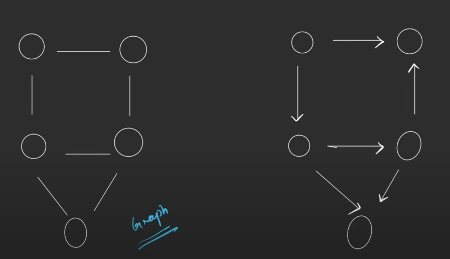

# INTRODUCTION TO GRAPH

---

**Graph:-** A graph is a non-linear kind of data structure made up of nodes or vertices and edges. The edges connect any two nodes in the graph, and the nodes are also known as vertices.

### Components of a Graph

**1. Vertices**(Nodes):

 - The fundamental units of the graph.
 - Represent entities or points in the structure.

**2. Edges** (Links):

 - Connections between pairs of vertices.
 - Represent relationships or paths between entities.

        Total number of Vertices
        = 2 x No. of Edges

### Types of Graphs

1. **Directed Graph (Digraph):**

   - Each edge has a direction, going from one vertex to another.
   - Represented as an ordered pair (u, v) indicating an edge from vertex u to vertex v.

2. **Undirected Graph:**

   - Edges have no direction.
   - Represented as an unordered pair {u, v}, meaning the connection between u and v is bidirectional.

3. **Weighted Graph:**
   - Each edge has a weight or cost associated with it.
   - Used to represent distances, costs, or other metrics.
4. **Unweighted Graph:**
   - Edges do not have weights; they simply represent connections.

5. **Cyclic Graph:**
   - Contains at least one cycle, a path of edges and vertices wherein a vertex is reachable from itself.

6. **Acyclic Graph:**
   - Does not contain any cycles.
   - Directed Acyclic Graph (DAG) is a special type of directed graph with no directed cycles.

### DEGREE OF A GRAPH

**Degree:** The degree of a vertex in a graph is a measure of the number of edges incident to (connected to) the vertex. 

**1. Degree in an Undirected Graph**
  
- The degree of a vertex is the number of edge connected to it. If a vertex 𝑣 has 𝑘 edges connected to it, then the degree of 𝑣 is 𝑘.

**2. Degree in a Directed Graph**

In a directed graph, where edges have a direction, the degree is split into two parts:

- **In-Degree:** The number of edges coming into a vertex. If a vertex \( v \) has \( k \) incoming edges, then the in-degree of \( v \) is \( k \).
- **Out-Degree:** The number of edges going out from a vertex. If a vertex \( v \) has \( k \) outgoing edges, then the out-degree of \( v \) is \( k \).

